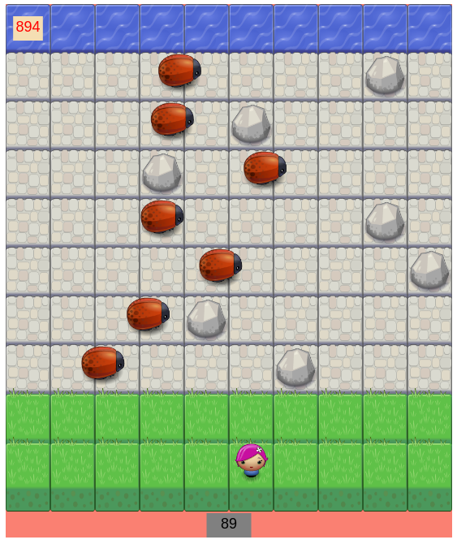
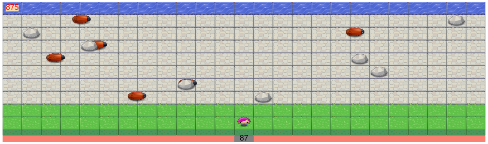
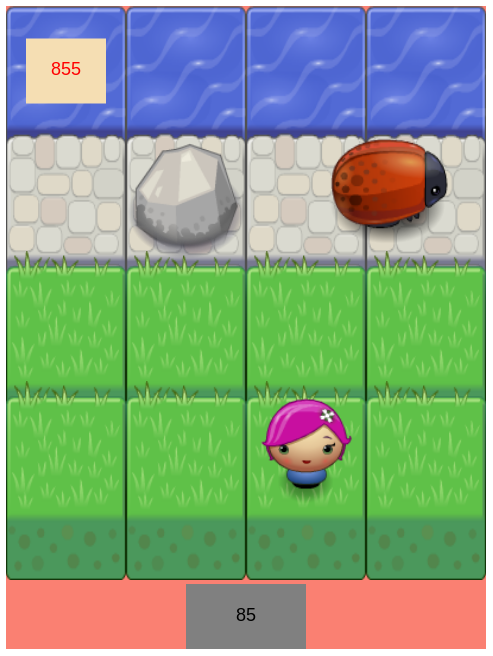
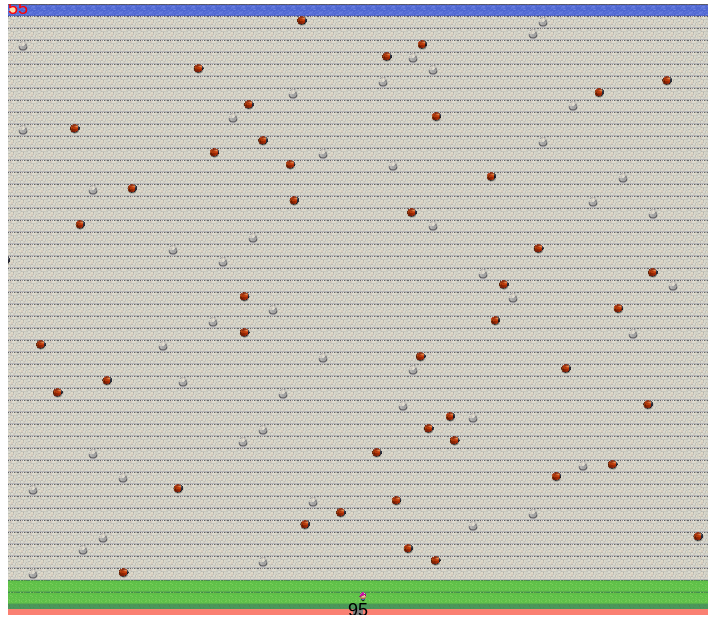

#Udacity
###Front End Web Developer Nanodegree
##Project 3: Classic Arcade Game Clone

### Project Goals

Study the relevant Udacity courses for project:

* [Object-Oriented Javascript](https://www.udacity.com/course/ud015)
* [HTML5 Canvas](https://www.udacity.com/course/ud292)
* [Writing READMEs](https://www.udacity.com/course/ud777)

### The planned game
#####_Please note: the submitted project (November 30, 2015) is an incomplete 'game'._
#####You can see the submitted project runnning on [GitHub Pages](http://klong.github.io/p3-classic-arcade-game-clone/)
The project will be further customised and become a playable game.

#####The final game will have ;

 * A time-limited game rounds, where the players energy runs down.
 * Different treasue 'buried' under rocks on the game area.
 * The players goal of digging up treasure from the game board and taking it to a location.  
 * Bugs running across the game area at different speeds, bumping into the player and rocks.
 * The bugs re-bury the treasure gradually as they pass over the rocks.
 * The player has to avoid touching the bugs as they deplete the players 'energy' faster.
 * The player and bugs can replenish their energy by passing over a star.

Some of the code to support these game concepts is implemented, but the game itself is incomplete.

##Game Engine

The engine.js code has been modified to support a flexible tile-sized game area.
The engine can be intialised to produce a game board with any number of rows and columns and a custom height and width for the tiles. The tiles can show the whole area or a portion of the source graphics.

####here is a 10 x 10 smaller tile game board.

####; and some other examples which have similar canvas dimensions,

a game board with 25 x 10 thin (non-square) tiles,

a game board with 4 x 4 tiles larger than the source image dimensions,

a game board with 70 x 50 very small tiles. 

